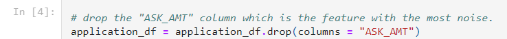
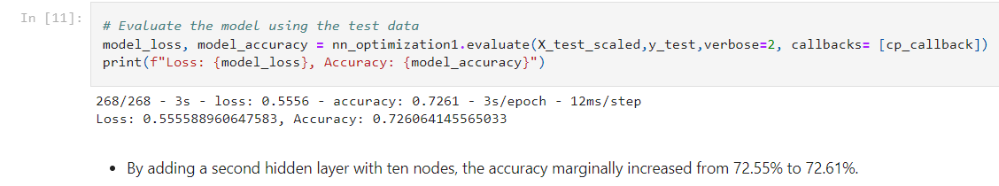
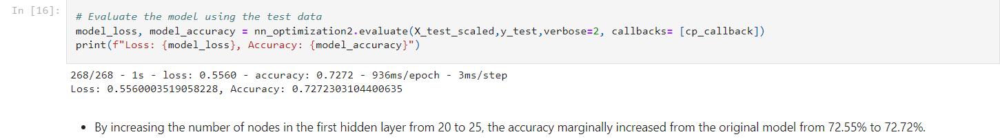
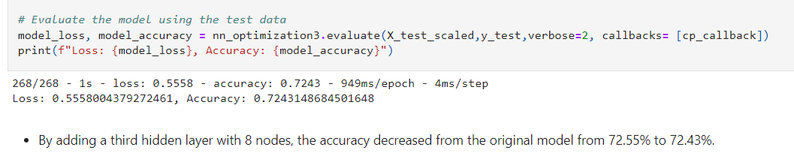

# Neural_Network_Charity_Analysis
## Overview of Analysis
In this project, an an analysis of charity data containing 34,000+ charity fund applicants was used to create a binary classifier that is capable of predicting whether applicants will have successful campaigns.  

* Technologies used in this analysis:
    * Python scikit-learn machine learning library
    * Python Tensorflow Keras neural network library
    * Python Pandas for data preprocessing   

## Results

* **Data Pre-Processing:**
    * The target vector chosen for this model is the column that states whether or not the campaign was successful.
    * There are 40 features that were used for the neural network model, which include the application type, income of applicant, affiliation, organization, use case, etc. 
    * There was some extraneous data that was removed from the input data as to not skew the model, such as Employee identification number and the applicant's name.  
    
* **Compiling, Training, and Evaluating the Model:**
    * In the initial neural network model, the input layer had 40 nodes (one for each feature) and there was one hidden layer with 20 nodes. The output layer had one node. The activation function used for the input and hidden layer was the ReLU function since the data is non-linear and the output layer activation function was the sigmoid function for binary classification.
    * The initial model was able to acheive an accuracy of 72.55%.
    * Optimization steps taken to improve accuracy:
        * Removing the ask amount ("ASK_AMT" column) since it had the most varying values of all features:
         

        * Adding a second hidden layer with 10 nodes (see image for results of optimization):
         
    
        * Adding five more nodes to the first hidden layer (from 20 to 25 nodes) along with the second hidden layer with 10 nodes (see image for results of optimization):
         

        * Adding a third hidden layer with 8 nodes with the original 20 nodes in the first hidden layer and the second layer with 10 nodes (see image for results of optimization):
         
        
## Summary
The attempts to optimize the model caused only a marginal increase in the accuracy. Removing the ask amount feature, adding five more nodes to the first hidden layer (from 20 to 25 nodes) along with the second hidden layer with 10 nodes increased the accuracy the most (from 72.55% to 72.72%). Adding a third hidden layer actually decreased the accuracy of the model.  

Since the neural network was unable to achieve an accuracy higher than 72.72%, here are two possible ways to make a more accurate model: 

* Use the Keras Tuner library, which is a library that helps choose the most optimal hyperparameters for a neural network model. 

* Use a different machine learning model instead of the neural network, such as a random forest classification model.